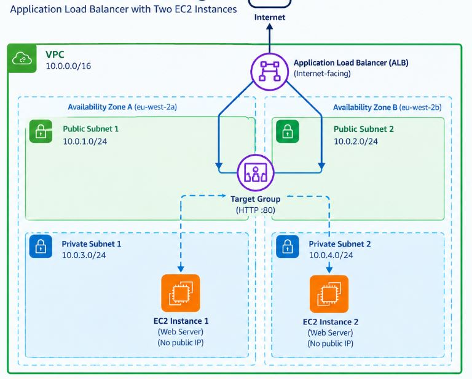
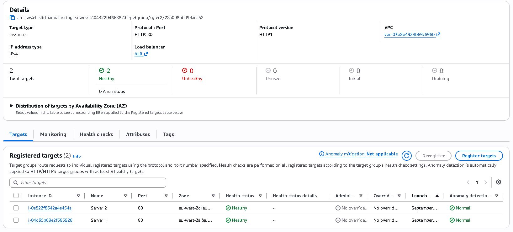
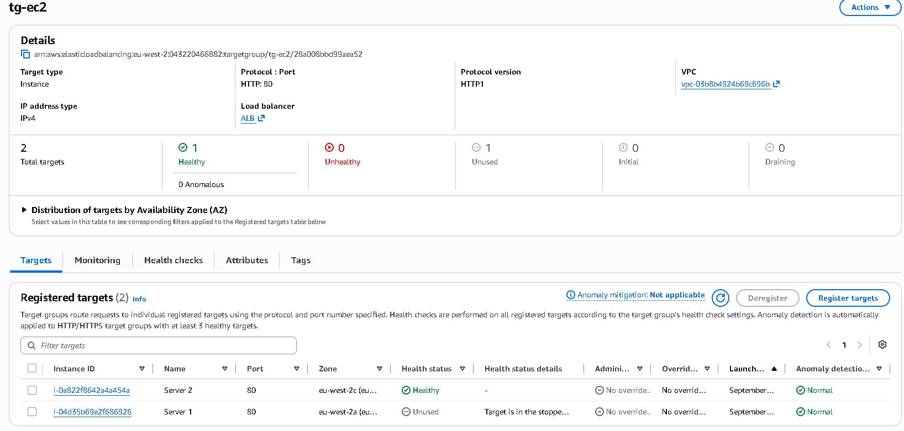
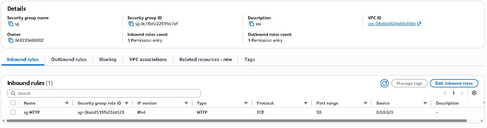

# 02 — Application Load Balancer

## Overview

This project implements an AWS Application Load Balancer (ALB) distributing HTTP traffic across two EC2 instances.

The infrastructure demonstrates load balancing, target groups, health checks, availability zones, and Security Group isolation.

## Architecture

## Testing

### Target Health

Both EC2 instances were registered with the target group and reported
a healthy status.

### Load Balancing

Each EC2 instance was configured to return different content so that
traffic distribution could be verified.

#### Server 1

#### Server 2

Refreshing the ALB DNS endpoint returned responses from both EC2
instances, confirming that the ALB was distributing requests across
the target group.

### Health Check 

One EC2 instance was stopped to simulate an unhealthy target.

### Security

The EC2 Security Group only permits HTTP traffic originating from the
ALB Security Group. This prevents direct HTTP access to the EC2
instances.

